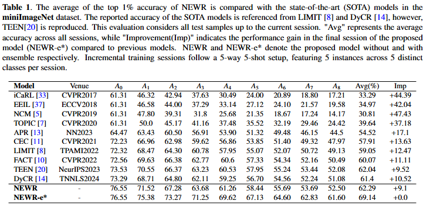
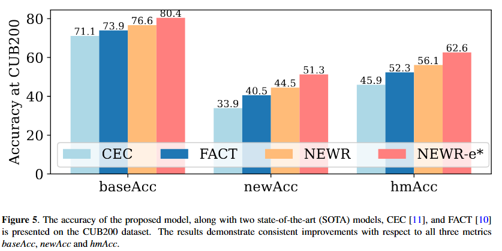

#Few Shot Class Incremental Learning by
Negative Exponential Weight Regularizer and Ensembling

##Citation

## Abstract
Few-Shot Class Incremental Learning (FSCIL) suffers from catastrophic forgetting and overfitting during the fine-tuning phase due to a limited sample of new classes. Some of the recent methods aim to address this by selectively updating weights through thresholding and masking, but they often struggle to integrate seamlessly with the rest of the model weights. This paper introduces a Negative Exponential Weight Regularizer
(NEWR) to fine-tune the model on limited samples of new classes while retaining the old knowledge. NEWR applies a smooth threshold to weight updates, making higher-magnitude weights more resistant to change. In addition, an ensemble method is applied on two additional classification heads to overcome the forgetting further at inference time; where one head is biased toward base classes while the other one is biased toward incremental classes. Evaluation on miniImageNet, CIFAR100 and CUB200 benchmark datasets demonstrates that the proposed model outperforms the state-of-the-art (SOTA) models.

## Results
 

 

Please refer to the paper...

## Prerequisites

The following packages are required to run the scripts:

- [PyTorch-1.4 and torchvision](https://pytorch.org)

- tqdm

## Dataset
We provide the source code on three benchmark datasets, i.e., CIFAR100, CUB200 and miniImageNet. 
Please follow the guidelines in [CEC](https://github.com/icoz69/CEC-CVPR2021) to prepare them.

## Code Structures and details
There are five major directories.
 - `models`: It contains the backbone network and training protocols for the experiment.
 - `data`: The splits for the data sets.
 - `dataSet`: The data sets.
 - `dataloader`: Dataloader of different datasets.
 - `script`: Execution details.
## Training scripts

Please see `scripts` folder.

## Acknowledgment
We thank the following repos providing helpful components/functions in our work.

- [CEC](https://github.com/icoz69/CEC-CVPR2021)
- [TEEN](https://github.com/wangkiw/TEEN)

## Contact 
If there are any questions, please feel free to contact with the author: K K Singh (krishnasingh@rguktn.ac.in)

